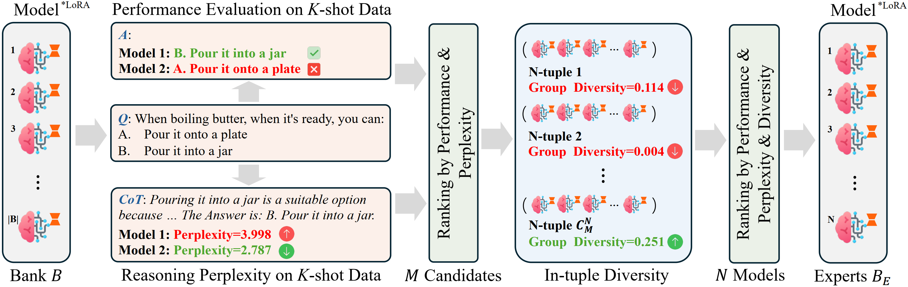
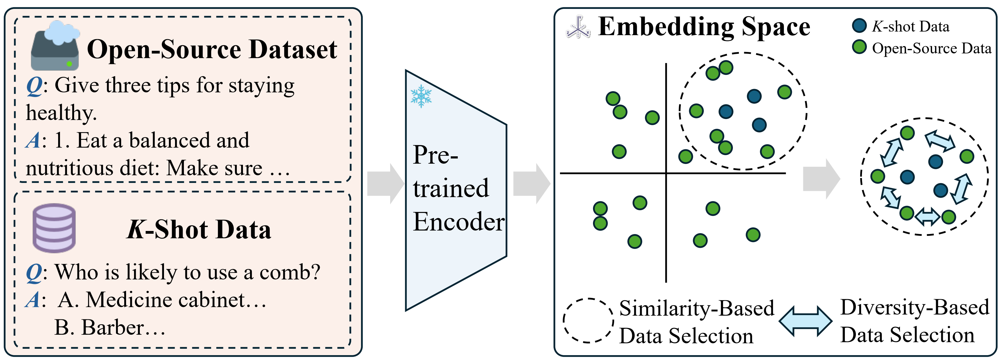

# Leveraging Open Knowledge for Advancing Task Expertise in Large Language Models

## Abstract
The efficacy of scaling laws in large language models (LLMs) and their subsequent applications underscore the paramount significance of high-quality data in nurturing emerging capabilities. The open-source community contributes to a wealth of both real-world and synthetic datasets, encompassing various fine-tuned LoRA models. Such open resources expedite the development of LLMs for downstream applications even
under data-scarce scenarios. Given the performance of these models on specific tasks, two pertinent questions arise: 1) How can we precisely identify the most beneficial LoRA models from the pool that improve downstream adaptation, especially when the small quantity of human-verified samples in the downstream tasks poses challenge to the selection accuracy. 2) How can we make the best use of multiple models to solve the tasks of interest, where each model encapsulates a portion of indispensable domain knowledge that complements the knowledge of other models? In this paper, we demonstrate the construction of a scalable and versatile pipeline named \textbf{ROCKET} for robust production of models that excel in tasks of interest. We start with the collection and maintenance of a reliable LoRA bank, which is comprised of models fine-tuned on diverse high-quality open datasets. Subsequently, we propose an efficient method to pinpoint the most promising models from the bank for each task. To effectively extend the knowledge boundary beyond a single model, a mixture-of-experts (MoE) approach is developed to meticulously establish the strategies of model initialization, merging, and continual training. Lastly, we present a data selection and augmentation scheme to further enhance performance. Extensive experimental results confirm the superiority of our approach over existing methods.


## Reqiurements

```bash
pip install -r requirements.txt
```

## Model Selection



In order to run the model selection script, you need to prepare the following:

1. Base model
2. LoRA model corresponding to the Base model
3. Data with answers associated with its CoT process

The LoRA Bank(including all the LoRA models trained on open-source data) is available in [this url](https://drive.google.com/file/d/1jueVxCyln5DL3tHP_d2UiOM7wMMHJxn-/view?usp=sharing)

```bash
### Loss Computation
cd Model_Selection
CUDA_VISIBLE_DEVICES=0 python compute_loss.py \
    --batch_size 1 \
    --model_path pretrained_models/mistral-7b-v0.2 \
    --peft_path Rocket/LoRA_Bank/mistral/arc-c_cot_lora_r16 \
    --data_path Data/arc-c_cot_50shot.json 
```

To obtain the result of K-shot evaluation, we use [opencompass](https://github.com/open-compass/opencompass). Thanks to their great work.


## Data Selection


Data selection requires preparation of: 1) alternative open-source dataset and 2) K-shot data required for the task of interest. By calculating the similarity between open-source data and K-shot data, the most relevant data are extracted, and the data with high similarity are removed.

```bash
cd Data_Augmentation
CUDA_VISIBLE_DEVICES=0,1,2,3,4,5,6,7 python data_aug.py \
--opensource_path Data/commonsense_qa.json \
--kshot_data_path Data/arc-c_50shot.json \
```

## Mixture of Expert Training 


To train the MoE model, you need to prepare the model, store it in the corresponding path, and run the following script

```bash
cd LoRAMoE
CUDA_VISIBLE_DEVICES=0,1,2,3 deepspeed --num_gpus=4 finetune.py \
--deepspeed "./ds_config_zero3.json" \
--base_model 'pretrained_models/LLaMa-2-7B' \
--data_path 'Data_Augmentation/arc-c_aug.json' \
--output_dir './checkpoints/arc-c' \
--prompt_template_name 'llama2' \
--num_epochs 5 \
--cutoff_len 1024 \
--micro_batch_size 2 \
--load_expert_weight expert_weight/llama/arc-c.txt \
--train_router_only False \
--lora_type "lora_moe"
```

You can also download our trained MoE model in [this url](https://drive.google.com/file/d/1jueVxCyln5DL3tHP_d2UiOM7wMMHJxn-/view?usp=sharing) directly.

## Evaluation
In our work we use [opencompass](https://github.com/open-compass/opencompass) for inference and evaluation.

### Environment Setup
  ```bash
  conda create --name opencompass python=3.10 -y
  conda activate opencompass
  git clone https://github.com/open-compass/opencompass 
  cd opencompass
  pip install -e .
  ```

### Data Preparation
    ```bash
    wget https://github.com/open-compass/opencompass/releases/download/0.2.2.rc1/OpenCompassData-core-20240207.zip
    unzip OpenCompassData-core-20240207.zip
    ```

### Start Evaluation

```bash
CUDA_VISIBLE_DEVICES=0 python run.py --datasets ARC_c_gen --models hf_mistral_7b.py
```
